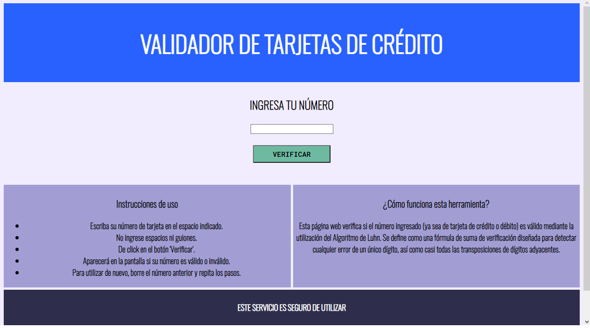
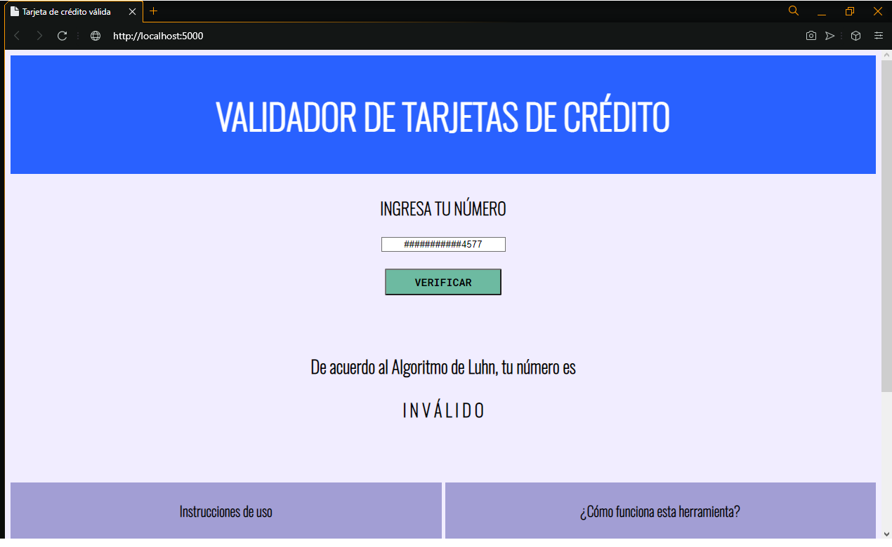
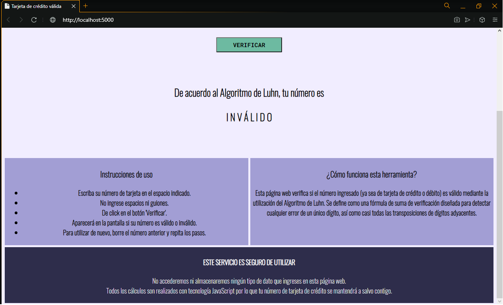

# VALIDADOR DE TARJETAS DE CRÉDITO

El presente proyecto se trata de una aplicación web que valida tarjetas de crédito o débito. Mediante la utilización del Algoritmo de Luhn, permite al usuario verificar si el número incresado es válido o inválido.

### Visualización del producto final:

## INVESTIGACIÓN UX

La aplicación web está diseñada para aquellos usuarios que deseen conocer con certeza si, según el método Algoritmo de Luhn, el número de su tarjeta de crédito o débito (16 dígitos) es válido o no. 

Hoy en día esta información es necesaria de saber ya que muchas plataformas de compra online requieren un número válido de tarjeta al momento de registrarse en el sitio web o realizar una compra. Si no se desea compartir dicha información en un sitio inseguro, este programa brinda la posibilidad de saberlo entregando la seguridad de que sus datos no serán almacenados. 

De este modo, el objetivo principal es proveer una herramienta sencilla de fácil acceso y uso que permita a los usuarios conocer la información deseada, entregando el resultado con claridad en pantalla sin la necesidad de almacenar los datos entregados por el mismo.

## PROCESO DE DISEÑO

En primera instancia se comenzó con una lluvia de ideas respecto a cómo debería lucir la aplicación web. Ya que su función es proveer información de manera directa y sencilla, el diseño de la misma ha de ser simple, sobrio y sin elementos que distraigan al usuario. 

### Primer Prototipo:

El diseño mostraba, además de la etiqueta para ingresar el número y su respectivo botón de ejecución, tres recuadros que brindaban información relevante para la aplicación web: Instrucciones de uso, qué es el Algoritmo de Luhn y una advertencia. Adicionalmente, para conocer si el número es válido o inválido, la página llevaba a otra pantalla donde daba el resultado con la posibilidad de regresar al inicio mediante un botón. 

De acuerdo al feedback entregado por usuarios, los cambios a realizar debían ser los siguientes:

1. La página debe estar en español.
Si bien el inglés es conocido como un lenguaje universal, la aplicación está dirigida a usuarios de habla hispana y puede ser que no todos manejen el idioma. 

2. No mostrar resultado en una página distinta.
Tomando en consideración que la información entregada es reducida, resulta mucho más cómodo que el resultado se muestre en la misma página como una pestaña emergente, evitando lo tedioso de moverse entre páginas solo para mostrar 'Valido' o 'Inválido'.

3. Mejor distribución de elementos.
Si bien los usuarios mostraron estar de acuerdo con los recuadros de información, estos expresaron que, visualmente hablando, es mejor si la advertencia se separa de los demás para hacer más énfasis en la misma. 

### Prototipo final:

Con la visión final en papel y lápiz, se procedió a traducirlo a FIGMA como un prototipo de alta fidelidad.
[PROTOTIPO FIGMA](https://www.figma.com/file/IvdTzj18hendJlroWDgZgJ/CREDIT-CARD-VALIDATOR?node-id=0%3A1)

Los colores sólidos y sobrios se escogieron pensando en los tonos con que, usualmente, se asocian las tarjetas de créditos o bancos: Azul. 